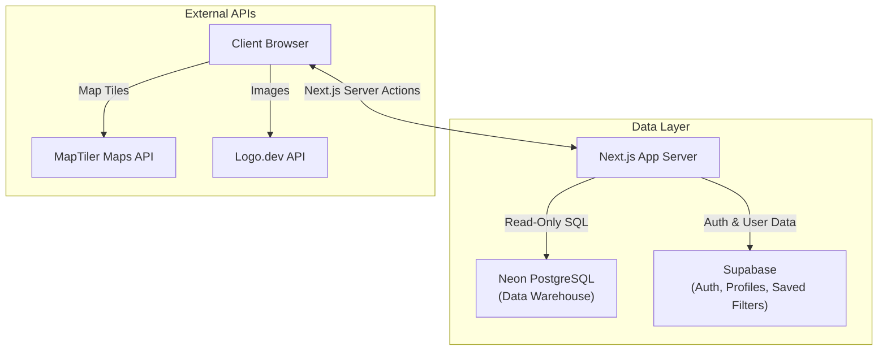

# Bamboo Reports By ResearchNXT

A modern Business Intelligence dashboard built with Next.js App Router, React, and TypeScript. The app delivers account, center, service, and prospect intelligence through rich filtering, data visualization, and export workflows.

[](https://vercel.com)
[](https://nextjs.org/)
[](https://react.dev/)
[](https://www.typescriptlang.org/)
[](LICENSE)
[](https://supabase.com)

---

## Table of Contents

- [Overview](#overview)
- [Key Features](#key-features)
- [Architecture & Data Flow](#architecture--data-flow)
- [Tech Stack](#tech-stack)
- [Project Structure](#project-structure)
- [Getting Started](#getting-started)
- [Environment Variables](#environment-variables)
- [Authentication & User Data](#authentication--user-data)
- [Database & Schema](#database--schema)
- [Deployment](#deployment)
- [Troubleshooting](#troubleshooting)
- [Documentation Reference](#documentation-reference)

---

## Overview

Bamboo Reports provides a unified view of business entities (**Accounts**, **Centers**, **Services**, **Functions**, and **Prospects**). The dashboard combines high-performance data grids with geospatial analytics to empower decision-makers.

### Core Value Proposition
- **High Signal-to-Noise:** Designed for rapid filtering and drilling down into large datasets.
- **Geospatial Intelligence:** Visualize delivery center density across Indian metros.
- **Persistence:** Save complex filter configurations to the cloud (Supabase) for recurring reporting tasks.
- **Exportability:** Generate boardroom-ready Excel reports with multi-sheet support.

---

## Key Features

### Dashboard and Insights
- **Smart Summary Cards:** Real-time filtered vs. total counts per entity.
- **Interactive Charts:** Recharts-powered Pie and Donut charts for categorical breakdowns (Region, Nature, Revenue, Employees).
- **Tabbed Navigation:** Seamless switching between Accounts, Centers, and Prospects contexts.
- **Geospatial Analytics:** MapTiler (MapLibre) map with clustering for center locations, optimized for 5000+ points.

### Advanced Filtering Engine
- **Multi-Select Filters:** Country, Region, Industry, Category, Nature, and more.
- **Precision Slicing:** "Include" vs. "Exclude" toggle per filter group.
- **Range Sliders:** Revenue and Employee count sliders with logarithmic scaling logic.
- **Saved Filters:** Persist complex filter sets to Supabase with RLS isolation.
- **Debounced Search:** 300ms debounce on keyword inputs to optimize database load.

### Data Management
- **Paginated Tables:** 50 items per page, optimized for performance.
- **Row-Level Details:** Comprehensive dialog views for every entity.
- **Type Safety:** Shared TypeScript definitions ensuring consistency from DB to UI.

### Export and Integrations
- **Excel Exports:** Native `.xlsx` generation using `exceljs`.
- **Multi-Sheet Support:** Export all filtered entities into separate sheets in a single file.
- **Logo Integration:** Automated company logo fetching via Logo.dev API.

---

## Architecture & Data Flow

The application follows a **Server-First** data architecture with **Client-Side** interactivity.



### Data Fetching Strategy
1.  **Initial Load:** `Promise.all` fetches metadata (Filters, Counts) and initial page data concurrently.
2.  **Filtering:** User actions trigger Server Actions (`app/actions.ts`) which construct dynamic SQL queries.
3.  **Caching:** In-memory `Map` cache (5-minute TTL) prevents redundant DB hits for static reference data (Countries, Industries).

---

## Tech Stack

### Core Framework
| Technology | Version | Purpose |
|------------|---------|---------|
| **Next.js** | 14.2.x | App Router, Server Actions, SSR |
| **React** | 19 | Component Library, Hooks |
| **TypeScript** | 5 | Strict Type Safety |

### UI and Styling
| Technology | Purpose |
|------------|---------|
| **Tailwind CSS** | Utility-first styling system |
| **shadcn/ui** | Accessible component primitives (Radix UI) |
| **Lucide React** | Consistent iconography |
| **next-themes** | Dark/Light mode support |

### Backend and Utilities
| Technology | Purpose |
|------------|---------|
| **Supabase** | Authentication, User Profiles, Saved Filters (JSONB) |
| **Neon PostgreSQL** | Primary Business Intelligence Data Warehouse |
| **Zod** | Schema validation for forms and API inputs |
| **date-fns** | robust date manipulation |

---

## Project Structure

A highly organized codebase designed for scalability.

```bash
bamboo-reports-nextjs/
├── app/                        # Next.js App Router (Pages & Layouts)
│   ├── actions.ts              # SERVER ACTIONS (Data Fetching Layer)
│   ├── layout.tsx              # Root layout (Providers, Toasters)
│   └── page.tsx                # Main Dashboard Entry Point
├── components/                 # React Components
│   ├── charts/                 # Recharts Visualizations
│   ├── dashboard/              # Summary Cards & Hero Stats
│   ├── dialogs/                # Detail Views (Modal Popups)
│   ├── filters/                # Sidebar Filter Logic
│   ├── maps/                   # MapTiler + MapLibre Integration
│   ├── saved-filters/          # Saved Filter CRUD Components
│   ├── tables/                 # Data Grid Components
│   └── ui/                     # Shared Design System (shadcn)
├── lib/                        # Utilities & Configuration
│   ├── supabase/               # Supabase Client Factory
│   ├── types.ts                # SHARED TYPES (DB & UI)
│   └── utils/                  # Helper Functions (Formatters, Sorters)
├── documentation/              # DETAILED TECHNICAL DOCS
│   ├── schema-migration-guide.md
│   ├── supabase-auth-setup.md
│   └── supabase-saved-filters.md
└── public/                     # Static Assets (Images, Fonts)
```

---

## Getting Started

### Prerequisites
- **Node.js 18.17+**
- **npm** (v9+) or **pnpm**
- **Neon PostgreSQL:** Connection string for the data warehouse.
- **Supabase Project:** For Authentication and User State.
- **MapTiler API Key:** For the geospatial view.

### Installation

1.  **Clone the Repository:**
    ```bash
    git clone https://github.com/researchnxt/bamboo-reports-nextjs.git
    cd bamboo-reports-nextjs
    ```

2.  **Install Dependencies:**
    ```bash
    npm install
    # or
    pnpm install
    ```

3.  **Environment Setup:**
    Duplicate the example file and fill in your secrets.
    ```bash
    cp .env.example .env.local
    ```

4.  **Run Development Server:**
    ```bash
    npm run dev
    ```
    Open [http://localhost:3000](http://localhost:3000) to view the app.

---

## Environment Variables

| Variable | Required | Description |
|----------|----------|-------------|
| `DATABASE_URL` | **Yes** | Neon PostgreSQL connection string (Postgres protocol). |
| `NEXT_PUBLIC_SUPABASE_URL` | **Yes** | Your Supabase Project URL. |
| `NEXT_PUBLIC_SUPABASE_ANON_KEY` | **Yes** | Supabase Public Anon Key (safe for client). |
| `NEXT_PUBLIC_MAPTILER_KEY` | **Yes** | MapTiler public key for rendering map tiles. |
| `NEXT_PUBLIC_LOGO_DEV_TOKEN` | No | Token for fetching company logos (optional). |

---

## Authentication & User Data

The app delegates identity management to **Supabase Auth**.

-   **Sign Up/Login:** Standard Email/Password flow.
-   **Session Persistance:** Handled via HTTP-only cookies (Next.js Middleware).
-   **User Data:**
    -   **`public.profiles`**: Stores user metadata (First Name, Last Name, Role).
    -   **`public.saved_filters`**: Stores JSON blobs of user's filter configurations.
-   **Security:** Row Level Security (RLS) ensures full data isolation between users.

> **Setup Guide:** Follow the [Supabase Auth Setup](documentation/supabase-auth-setup.md) guide to initialize your Supabase project tables.

---

## Database & Schema

The core BI data resides in **Neon PostgreSQL**. We strictly follow `snake_case` naming.

-   **Tables:** `accounts`, `centers`, `services`, `functions`, `prospects`.
-   **Linkage:**
    -   `centers` are linked to `accounts` via `account_global_legal_name`.
    -   `services` are linked to `centers` via `cn_unique_key`.

> **Reference:** See the [Schema Migration Guide](documentation/schema-migration-guide.md) for the complete column definition and table relationships.

---

## Deployment

### Vercel (Recommended)

This project is optimized for Vercel.

1.  **Push to GitHub.**
2.  **Import in Vercel:** Select the repository.
3.  **Configure Environment Variables:** Add all keys from your `.env.local`.
4.  **Deploy:** Vercel will auto-detect Next.js and build.

*Note: The build process uses `pnpm` to ensure consistent dependency resolution.*

---

## Troubleshooting

| Issue | Possible Cause | Solution |
| :--- | :--- | :--- |
| **Map not loading** | Invalid MapTiler Key | Check `NEXT_PUBLIC_MAPTILER_KEY`. Ensure the key is active and has map tile access. |
| **"Database connection failed"** | Neon Scaling / Network | The Neon instance might be sleeping. Retry after 5 seconds. Check `DATABASE_URL`. |
| **Auth Errors (401/403)** | Supabase Config | Verify `NEXT_PUBLIC_SUPABASE_URL` and `ANON_KEY`. Check RLS policies in Supabase dashboard. |
| **Missing Logos** | Logo.dev Token | Ensure `NEXT_PUBLIC_LOGO_DEV_TOKEN` is set. If omitted, fallback initials are used. |

---

## Documentation Reference

We maintain detailed documentation for specific subsystems in the `documentation/` folder:

- [**Schema Guide**](documentation/schema-migration-guide.md): Deep dive into the data model and migration paths.
- [**Supabase Auth**](documentation/supabase-auth-setup.md): Setting up the `profiles` table and Auth triggers.
- [**Saved Filters**](documentation/supabase-saved-filters.md): Technical spec for the saved filters JSON structure.
- [**Project Architecture**](documentation/project-architecture.md): High-level design, Server Actions, and State Management.
- [**Developer Workflow**](documentation/developer-workflow.md): Guide for common tasks, adding filters, and troubleshooting.
- [**Logo Integration**](documentation/logo-integration.md): Setup and usage guide for the Logo.dev integration.

---

## License

Proprietary software owned by ResearchNXT.
